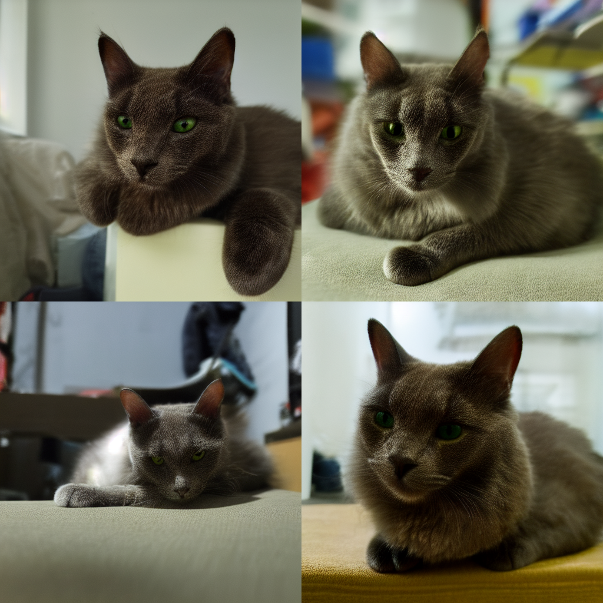
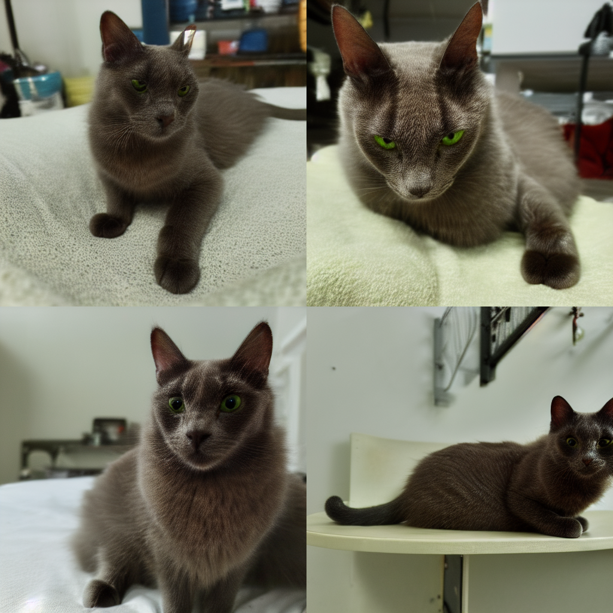
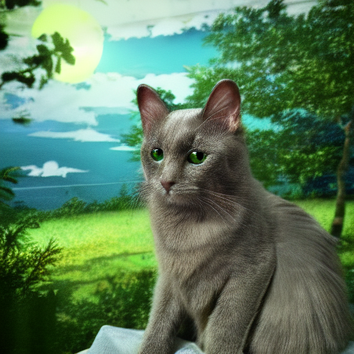
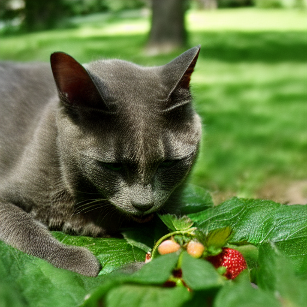

# LoRA-Wellington
Custom AI image generator which uses my cat Wellington as the context subject. Done using Google Gemini API (while it's free lol) and Low Rank Adaptation (LoRA).

As of today April 20th 2024, Google Gemini Pro 1.5 API is free for use until May 2 2024.

## Getting started

Steps taken to get from pictures of a subject to custom AI image generation.

1. Collect images of test subject into a directory and add a `5_` prefix to denote the training repeats. i.e. 5_Wellington
2. Open `main.py` and edit the folder name into `dir_path` and add labels for the name of your subject
3. Run `python main.py` in order to do the ff:
    - Standardize file names in directory (1.jpg, 2.jpg, 3.jpg)
    - Get Gemini to describe each image with 15 keywords
    - Sample final output should look like this
      
    - With each txt file looking like this
      
4. Upload directory into Google Drive.
5. Run LoRA training using the dreambooth method, as per specified in this [reddit post](https://www.reddit.com/r/StableDiffusion/comments/110up3f/i_made_a_lora_training_guide_its_a_colab_version/#lightbox).
6. Import the `.safetensors` files into Stable Diffusion. To get the web ui, follow this [guide](https://www.youtube.com/watch?v=onmqbI5XPH8).

Steps 4 and 5 just follow the guide, and the contents of this repository are mainly for automation of the labelling process.
If you want to try my (incompletely trained) model as well, the `.safetensors` file is [here](https://drive.google.com/file/d/1-4A6OlE5Nd9ljZj276QXw2FgU19oiFF2/view?usp=sharing).

## Outputs

### Adjective prompts
"<lora:LoRA-Ton:1> Wellington cat, serene, resting, high quality, masterpiece, plain background"

"<lora:LoRA-Ton:1> Wellington cat, big tummy, yellow eyes, majestic, regal, high quality, white background"

### Sentence prompts
"Wellington portrayed as an anime cat with a clear background showing the outdoors <lora:LoRA-Ton:1>"

"Wellington the cat munching on berries in the park <lora:LoRA-Ton:1>"

## Impediments

- Google seems to have blocked any AI generation related work on their platform (Colab). I only somehow managed to get one checkpoint of the model saved.
- Trying to run the Kohya trainer locally is quite difficult given how much interdependency there is between various open source projects (torch, jax, cuda, etc.).
In fact my attempt was unsuccesful as I had just dealt with way too many errors. Another option could have been connecting my local
compute to google colab (or buying compute instance via GCP VM) but this didn't guarantee colab blocking my notebook from running, so I
decided not to bother.
- The training data lacked a bit of variety. I should have gotten pics of Ton in different poses, actions, and angles. A lot of the images
honestly look similar, but I was very happy to have made it work somehow.
- Sometimes the model just forgot what `Wellington` was and id have to specify `cat` or else it would generate random subjects instead.\

