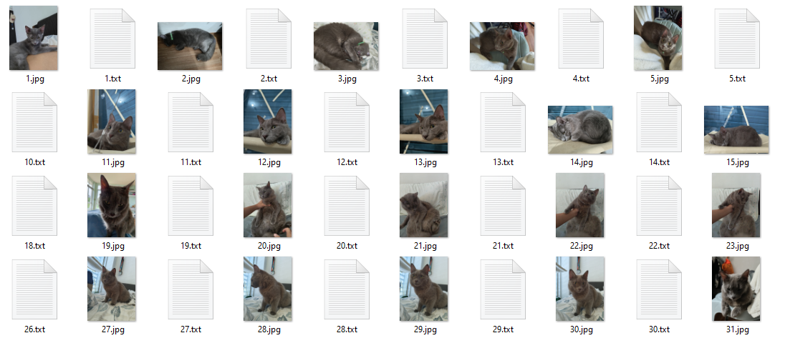
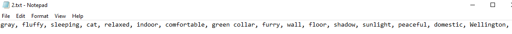

# LoRA-Wellington
Custom AI image generator which uses my cat Wellington as the context subject. Done using Google Gemini API (while it's free lol) and Low Rank Adaptation (LoRA).

As of today April 20th 2024, Google Gemini Pro 1.5 API is free for use until May 2 2024.

## Getting started

Steps taken to get from pictures of a subject to custom AI image generation.

1. Collect images of test subject into a directory and add a `5_` prefix to denote the training repeats. i.e. 5_Wellington
2. Open `main.py` and edit the folder name into `dir_path` and add labels for the name of your subject
3. Run `python main.py` in order to do the ff:
    - Standardize file names in directory (1.jpg, 2.jpg, 3.jpg)
    - Get Gemini to describe each image with 15 keywords
    - Sample final output should look like this
      
    - With each txt file looking like this
      
4. Upload directory into Google Drive.
5. Run LoRA training using the dreambooth method, as per specified in this [reddit post](https://www.reddit.com/r/StableDiffusion/comments/110up3f/i_made_a_lora_training_guide_its_a_colab_version/#lightbox).

Steps 4 and 5 just follow the guide, and the contents of this repository are mainly for automation of the labelling process.

## Outputs